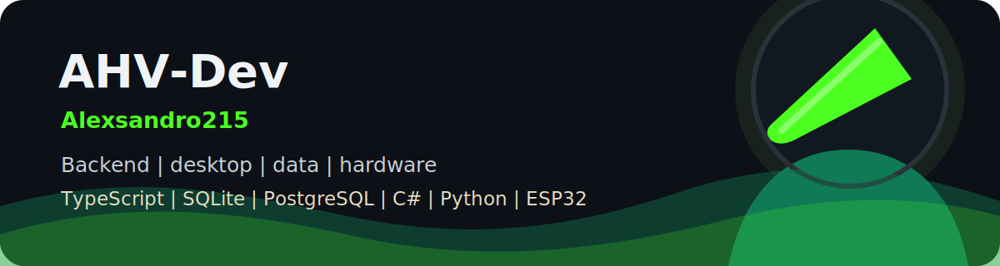
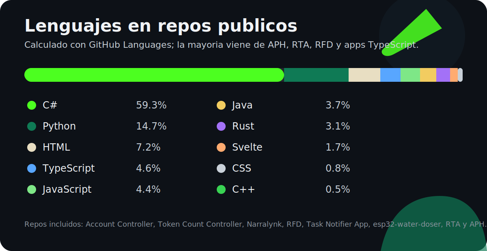

Soy Alexsandro, tambien AHV-Dev. Construyo herramientas practicas: APIs, bots, apps de escritorio, automatizaciones, dashboards de datos y firmware para ESP32. Me gusta entender el problema completo, desde la persistencia y la seguridad hasta la interfaz que usa la persona al final.

> Entender el pasado, para comprender el presente y construir el futuro.

## En corto

- Backend con TypeScript, Node.js, Express, Prisma, PostgreSQL, Zod y cifrado AES-256-GCM.
- Desktop con C#/.NET/WPF, Java/JavaFX, Electron y Tauri.
- Persistencia real con PostgreSQL, SQLite, SQLx, localStorage, TSV/properties y backups locales.
- Data y trading tools con Python, FastAPI, pandas, ccxt, Plotly, Jinja2 y backtesting.
- Frontend con Astro, React, Next.js, Vite, Svelte, Tailwind, Zustand y UI orientada a flujos de trabajo.
- Automatizacion con Playwright, PyAutoGUI, pystray, pygetwindow, PowerShell y scripting local.
- Hardware con ESP32, C++, Arduino framework, WiFi AP, WebServer, relevadores y botones fisicos.

## Stack tecnico

## Lenguajes

## Repos publicos revisados

| Proyecto | Que hace | Stack y persistencia |
| --- | --- | --- |
| [Account Controller](https://github.com/Alexsandro215/Account-Controller) | Boveda personal para pedir y guardar credenciales por Telegram. | TypeScript, Node.js, Express, Telegram Bot API, Prisma, PostgreSQL, Zod, AES-256-GCM |
| [APH](https://github.com/Alexsandro215/APH) | Plataforma Windows para analizar historiales de poker, dashboards, reportes y sincronizacion. | C#, .NET 8, WPF/XAML, SQLite local con `Microsoft.Data.Sqlite`, `aph.db`, Google Drive API, PDFsharp |
| [RFD](https://github.com/Alexsandro215/RFD) | Rapid Fetch Desk: app local para clientes, tramites, documentos y expedientes. | Tauri 2, Svelte 5, Rust, TypeScript, Vite, SQLite local `rfd.sqlite`, SQLx |
| [RTA](https://github.com/Alexsandro215/RTA) | Herramienta de analisis de mercado, OHLCV, estrategias, backtesting y vistas web. | Python, FastAPI, pandas, ccxt, Plotly, Jinja2, pytest, almacenamiento en CSV/JSON |
| [Task Notifier App](https://github.com/Alexsandro215/TaskNotifierApp) | App Windows para tareas, eventos, notas, recordatorios y bandeja del sistema. | Java 25, JavaFX, Gradle, AWT/SystemTray, persistencia en `%AppData%` con TSV/properties |
| [Token Count Controller](https://github.com/Alexsandro215/Token-CountController) | App de escritorio para controlar presupuestos de tokens por proveedor y cuenta. | Electron, JavaScript, HTML/CSS, tray app, localStorage |
| [Narralynk](https://github.com/Alexsandro215/Narralynk) | Interfaz web moderna con componentes interactivos y estado local. | React 19, Vite, TypeScript, Tailwind, Zustand, dnd-kit, lucide-react |
| [esp32-water-doser](https://github.com/Alexsandro215/esp32-water-doser) | Firmware ESP32 para controlar una bomba de agua por tiempos configurables. | C++, PlatformIO, Arduino framework, WiFi AP, WebServer, relevador, botones, memoria del ESP32 |

## Persistencia que manejo

| Tipo | Donde aparece |
| --- | --- |
| PostgreSQL + Prisma | Account Controller |
| SQLite + Microsoft.Data.Sqlite | APH |
| SQLite + SQLx | RFD |
| CSV/JSON para datasets y resultados | RTA |
| TSV/properties en AppData | Task Notifier App |
| localStorage | Token Count Controller |
| Parsing de CSV/XLSX en navegador | Herramientas de analisis y dashboards |
| Config JSON + variables de entorno | Automatizaciones y apps locales |
| Memoria/configuracion local en ESP32 | esp32-water-doser |

## Estadisticas

## Contacto

